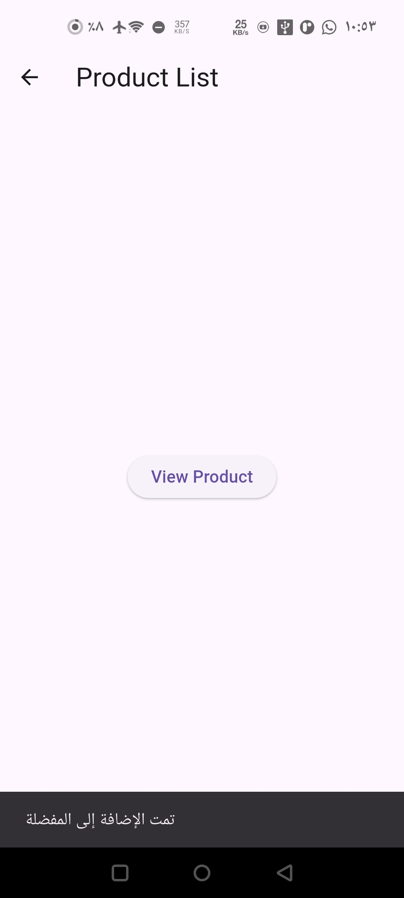

# Basic Stack Navigation - Flutter

## Description
This application demonstrates navigation between screens using Navigator.push() and Navigator.pop().

## Screens
- Home Screen
- Detail Screen

## How it works
- Press "Go to Details" → opens Detail Screen (push)
- Press "Go Back" → returns to Home Screen (pop)

## Screenshots

### Home Screen

### Detail Screen

(assets/33 PM.jpeg)
(assets/44 PM.jpeg)
(assets/55 PM.jpeg)
//
//
//
